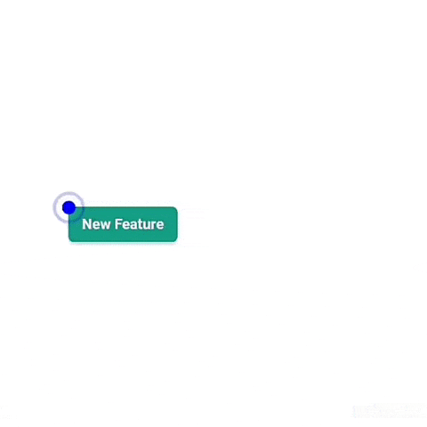

### Attract your user interest with Bip-Tour


## Installation 
```bash
    npm install bip-tour
```

## How to use it

- With webpack import
```js
    import Bip from 'bip-tour'
    let bip = new Bip(10, 20);
    bip.show()
```
- Inline mode
```html
  <script src="./node_modules/bip-tour/dist/bips.js"></script>
```
```js
    // in your js
    let bip = new window.Bip(10, 20)
    bip.show() // show bip 
```

## Api
- Constructor
    - *x* : Position from left
    - *y* : Position from top
    - *color* (optional) : The Dot color (string)  
    - *message* (optional) : An object 
        - *html* : The content in html
        - *bgColor* : The background color of the message box
        - *color* : The Text color of the message box  
         
    
   #### Example
```js
    new Bip(100, 200, "red", {html: "I'm a red dot with blue message box", bgColor: "blue", color: "white"})
    new Bip(300, 300, "rgba(0,0,0,0.5)", {html: "I'm a dark dot"})
``` 
- byId `static method`: (set dot for a given element by its id)
   - *id* : The id of html element
   - *color* (optional) : The Dot color (string)  
   - *message* (optional) : An object 
        - *html* : The content in html
        - *bgColor* : The background color of the message box
        - *color* : The Text color of the message box  
      
 ### Example  
```html
    <button id="new-feature">My new Feature</button>
```
```js
    let bip = Bip.byId("new-feature")
    bip.show()
    // or
    Bip.byId("new-feature").show()
```

- selector `static method` (Returns and array of Bip)
    - *selector* : The html selector (`string`)
    - *color* (optional) : The Dot color (string)  
    - *message* (optional) : An object 
        - *html* : The content in html
        - *bgColor* : The background color of the message box
        - *color* : The Text color of the message box  
     
 ### Example  
```html
    <button class="new-feature">My new Feature</button>
    <button class="new-feature">My new Feature</button>
    <button class="new-feature">My new Feature</button>
    <button class="new-feature">My new Feature</button>
```
```js
    let bip = Bip.selector(".new-feature")
    bip.forEach((b) => b.show())
    // or
    Bip.selector(".new-feature").forEach((b) => b.show())
```      